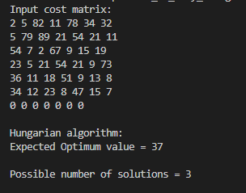
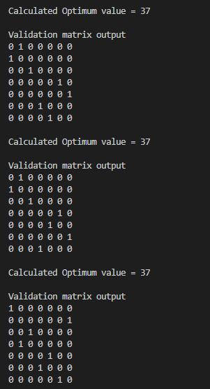
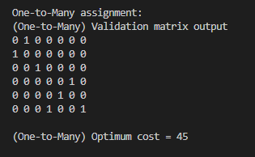

# One-to-Many Assignment Problem

**Author:** Monish Uthappa M C

This project was a stepping stone into my industry journey. It began as a technical task assigned during the hiring process for my first professional software role and laid the foundation for the work I went on to do. I am grateful to the mentors, managers, and teammates who supported and guided me throughout this journey.

## Overview

This project addresses the one-to-many assignment problem using cost matrices. It supports two main cases:

1. Assignments without requiring every row to have at least one assignment.
2. Assignments where each row must have at least one assignment.

The input is an XML file containing the cost matrix, and the output is a validation matrix stored in a CSV file. The validation matrix is also displayed on the console.

In the validation matrix, a value of `1` indicates an assignment between the corresponding row and column.

## Case 1: No condition for having at least one assignment for each row 

### Function

```cpp
get_validation_matrix_basic(string input, string output)
```

### Approach

For each column, the minimum cost is found, and the corresponding row-column assignment is selected.

## Case 2: At Least One Assignment for Each Row

### Function

```cpp
get_validation_matrix_atleast1(string input, string output)
```

### Approach

The Hungarian algorithm is used to find the best possible one-to-one assignment. If the matrices are tall matrices (row_size > col_size) or fat matrices (col_size > row_size), then they are zero padded to make them square.

During the research and implementation, it was observed that multiple one-to-one assignment solutions are possible with the same optimum value. For square matrices, any one of the solutions could be chosen. For fat matrices, the padded rows had to be removed and the best one had to be selected such that the cost of assigning the remaining columns is minimized. Tall matrices will not have assignments in all rows as there are not enough column candidates to pair them with. Taking all this into account, an algorithm was designed and it helped produce an optimum one-to-many assignment while ensuring that each row has at least one assignment, with the exception of tall matrcies. 

## Input and Output

### Input

An XML file containing the cost matrix.

### Output

A CSV file containing the validation matrix.

The output is also displayed on the console.

## Sample Output

### Input Cost Matrix

The program reads the cost matrix from an XML file and displays it on the console.



### Hungarian Algorithm Output

The Hungarian algorithm finds the expected optimum value and displays the possible one-to-one assignment solutions.



### Final One-to-Many Assignment Output

Among the solutions, choose the one such that the cost of assigning the remaining columns is minimized.



## Features

- Supports two-dimensional cost matrices of any dimension.
- Includes multiple XML files for different test cases, referenced in `main.cpp`.
- Displays validation matrices for all possible assignments generated by the Hungarian algorithm.
- Displays the final one-to-many assignment validation matrix.
- Displays the optimum costs.
- Has 2 versions of the algorithms:
    - Normal version (first implementation)
    - Eigen optimized version (an SIMD-oriented optimization)
- Calculates computation time using `<chrono>`. Added a benchmarking function to measure compute time over multiple runs.
- Added flags for console output and benchmarking options.

## Build and Run

Run the following commands from the repository root using GCC with C++17 support.

### Normal Version

Compile:

```powershell
g++ -std=c++17 -O3 -march=native main.cpp assignment_algo.cpp Lib\xml_reader\pugixml.cpp -o assignment_normal.exe
```

Run:

```powershell
.\assignment_normal.exe
```

### Eigen-Optimized Version

Compile:

```powershell
g++ -std=c++17 -O3 -march=native main.cpp assignment_algo_opt_eigen.cpp Lib\xml_reader\pugixml.cpp -o assignment_eigen_optimized.exe
```

Run:

```powershell
.\assignment_eigen_optimized.exe
```

Both implementations use `assignment_algo.h`. Compile only one implementation file at a time; linking both `assignment_algo.cpp` and `assignment_algo_opt_eigen.cpp` together will produce duplicate symbol errors.

## Output and Timing Options

Console output and computation timing are configured in `main.cpp` through `AssignmentOptions`:

```cpp
constexpr bool measure_computation_time = true;

AssignmentOptions options;
options.enable_output = !measure_computation_time;
options.measure_computation_time = measure_computation_time;

One2ManyAssignement OM(options);
```

When `measure_computation_time` is `false`, the program displays the input matrix, assignment results, validation matrices, and optimum costs.

When `measure_computation_time` is `true`, normal algorithm output is disabled and only the computation time is printed. The internal timer measures `MyHungarian()` and `best_of_remaining_asssignments()`. XML parsing and CSV output are excluded from the measured interval.

The two options can also be configured independently:

```cpp
AssignmentOptions options;
options.enable_output = true;
options.measure_computation_time = true;
```

This configuration displays both the normal algorithm output and the computation time.

## Benchmark Results

The benchmark performs 10 warm-up runs followed by 100 measured runs. XML parsing, state copying, console diagnostics, and CSV output are excluded from each measured interval. Times are reported in microseconds.

### Large Input: `input_cost_rect_fat_3.xml`

This input contains a `15 x 20` cost matrix.

| Implementation | Average | Median | Minimum | Maximum |
| --- | ---: | ---: | ---: | ---: |
| Normal | 86.644 us | 77.3 us | 76.1 us | 250.9 us |
| Eigen optimized | 48.504 us | 47.8 us | 47.1 us | 82.2 us |

For this input, the Eigen implementation was approximately `1.79x` faster by average time and `1.62x` faster by median time. The larger matrix provides enough work to offset Eigen's expression and mask setup costs. Operations such as reductions, broadcasting, and coefficient-wise matrix updates can process multiple values per SIMD instruction, making the Eigen implementation more effective.

The normal version also had a much larger maximum time. This may be caused by operating-system scheduling, CPU frequency changes, cache effects, or other background activity. Median and minimum times are therefore useful alongside the average.

### Small Input: `input_cost_rect_fat_2.xml`

This input contains a `6 x 8` cost matrix.

| Implementation | Average | Median | Minimum | Maximum |
| --- | ---: | ---: | ---: | ---: |
| Normal | 6.871 us | 6.9 us | 6.8 us | 7.7 us |
| Eigen optimized | 9.846 us | 9.8 us | 9.6 us | 17.1 us |

For this input, the normal implementation was approximately `1.43x` faster by average time and `1.42x` faster by median time. The matrix is too small to amortize the Eigen implementation's additional setup, temporary mask creation, conversions, and full-matrix passes. At this size, straightforward scalar loops and compiler auto-vectorization can be cheaper than explicitly constructing Eigen expressions.

### Interpretation

These results show that SIMD-oriented optimization has a crossover point rather than a guaranteed speedup:

- Small matrices favor simple loops with low setup and allocation overhead.
- Larger matrices give Eigen and SIMD more data to process per operation.
- Branching, dynamic vectors, backtracking, and memory allocation remain difficult to accelerate with SIMD.
- `-O3 -march=native` may auto-vectorize suitable loops in the normal implementation as well.

For a fair comparison, compile both implementations with the same compiler version and flags, run them on the same machine under similar system load, and use a Release build. Re-run the benchmarks after changing compiler flags, CPU, input data, or implementation details.


## Notes

The function for finding the best possible assignments was one of the more challenging parts of the implementation.

The optimum values from the Hungarian algorithm implementation were verified using an online Hungarian algorithm solver.

## Technologies Used

- C++
- XML parsing
- CSV output
- Hungarian Algorithm
- Chrono for runtime measurement

## References

- [Hungarian Algorithm Solver](https://www.hungarianalgorithm.com)
- [Hungarian Algorithm - Wikipedia](https://en.wikipedia.org/wiki/Hungarian_algorithm)


## Note

- This page summarizes the project design and implementation.

- The full source code is kept in a private repository. Access can be provided upon request for technical review.